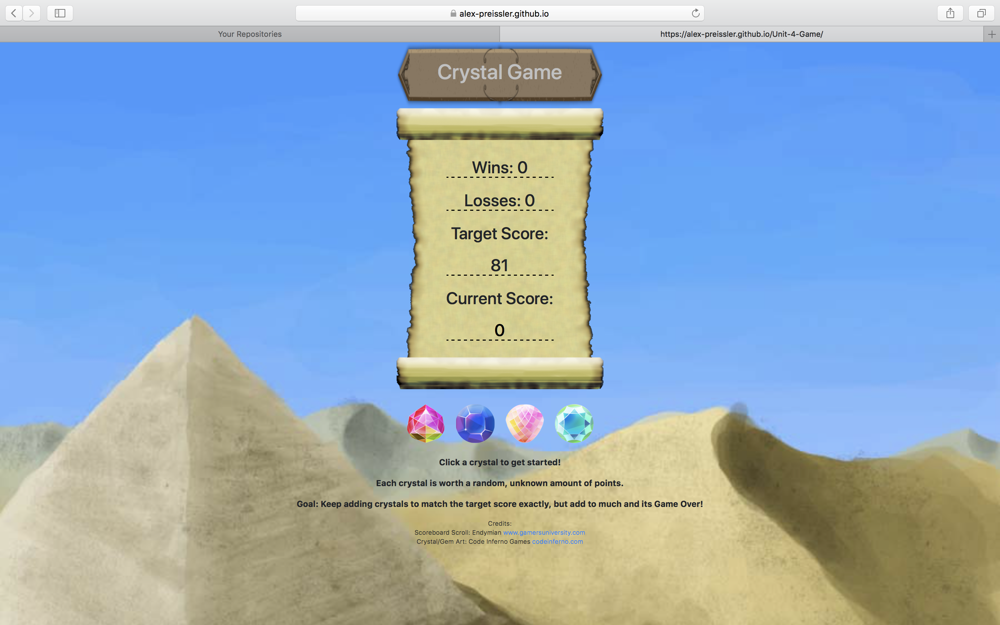

# Crystals-Number-Game #

A simple Harry Potter themed trivia game.

## Contributors ##

Alex Preissler

## Instructions ##

1. Clone repo.
2. Open "Crystal-Game" folder.
3. Launch Index.html in browser.
4. Click to begin.
5. The goal is to click the crystals in a sequence that allows the sum of the clicks to be equivalent
   to the target number.
6. The value of each crystal is selected randomly but will remain the same during the round.
7. At the end of each round a tally will be added to either wins or losses and round will reset. 

## Contact ##

For any help or requests please contact Alex Priessler.

Github: Alex-Preissler

Email: AlexJPreissler@Outlook.com

## Contributing to the project##

* Feel free to create a new branch and edit/add to the project.

